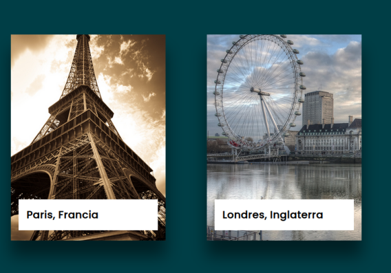
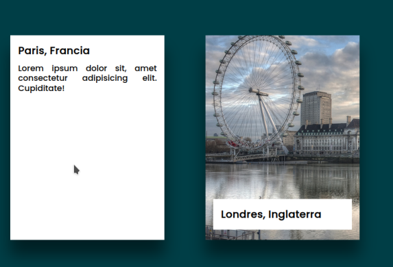

# Sobre esta práctica

Este ejercicio consiste en la creacion de tarjetas con imagen de fondo que ilustra una ciudad famosa del mundo asi como un pequeño titulo con el nombre de dicha ciudad.

Al pasar el mouse sobre cada tarjeta la imagen de fondo se oscurece, el área donde se muestra el título se expande hasta cubrir la totalidad de la tarjeta y se visualiza un pequeño parrafo con información relevante de dicha ciudad.

En esta practica se utilizó:
- Fuente: Poppins de google fonts (https://fonts.google.com/specimen/Poppins?query=popp)
- Background de body: #003e46
- Background de tarjeta: #000
- Background de contenedor de texto:#fff
- Color de letra: #000